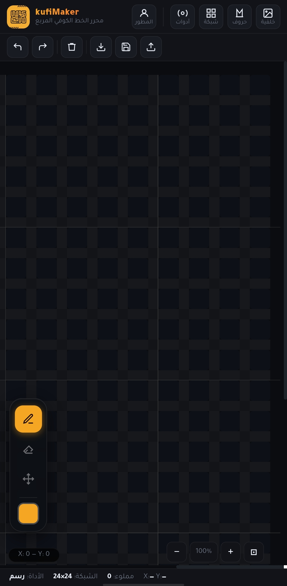
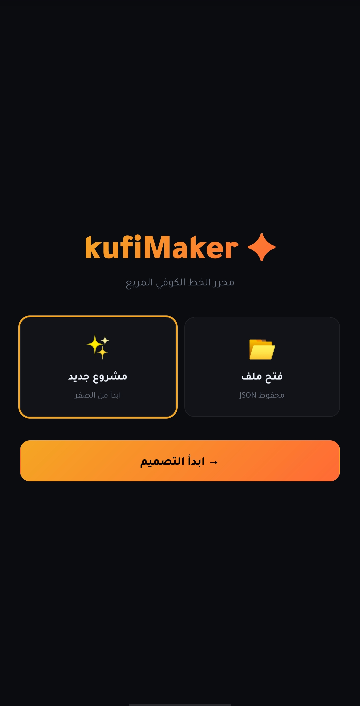

# kufiMaker ✦

**Square Kufic Script Editor — محرر الخط الكوفي المربع**

[🚀 Try it live / جرّب مباشرة](https://stop7orgo.github.io/kufiMaker/)

---

## English

kufiMaker is a free browser-based tool for designing Square Kufic calligraphy.
No installation. No account. Just open and start designing.

### Features
- 🎨 Customizable grid — size, gaps, corner radius
- ✍️ Letter library — save and reuse letter designs
- 🖼️ Reference image — trace over any image
- 📦 PNG export — clean or with background
- 💾 Save / Load — JSON project files
- 🔄 Undo / Redo
- 📱 Works on mobile and desktop
- ⚡ Single HTML file — works offline

### How to use
1. Open the link in any browser
2. Set grid size from the **Grid** panel
3. Draw by clicking cells
4. Add letters from the **Letters** panel
5. Export as PNG

---

## العربية

kufiMaker أداة ويب مجانية لتصميم الخط الكوفي المربع في المتصفح مباشرة.
بدون تثبيت، بدون تسجيل.

### المميزات
- 🎨 شبكة قابلة للتخصيص — حجم الخلايا والفجوات والاستدارة
- ✍️ مكتبة حروف — احفظ حروفك وأعد استخدامها
- 🖼️ صورة مرجعية — ضع صورة خلف الشبكة للنسخ عنها
- 📦 تصدير PNG — نظيف أو مع الخلفية
- 💾 حفظ وفتح — ملفات JSON
- 🔄 تراجع وتقديم
- 📱 يعمل على الجوال والحاسوب
- ⚡ ملف HTML واحد — يعمل بدون إنترنت

### كيف تستخدمه
1. افتح الرابط في أي متصفح
2. حدد حجم الشبكة من قائمة **شبكة**
3. ارسم بالنقر على الخلايا
4. أضف حروفاً من قائمة **حروف**
5. صدّر عملك PNG

---

## Screenshots

| | |
|---|---|
|  |  |
|  |  |

---

## License / الترخيص

MIT — use freely / استخدم بحرية مع الإشارة للمصدر

---

Made with ♥ for Arabic calligraphy

